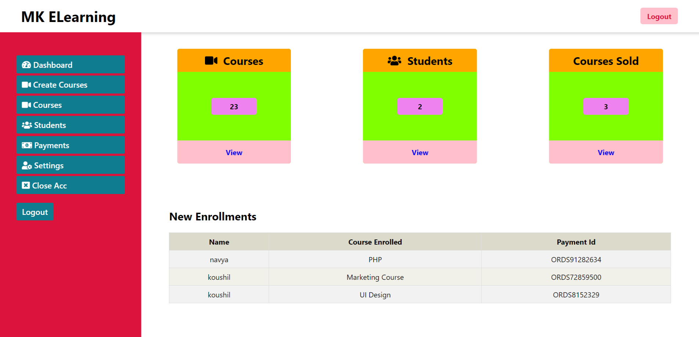
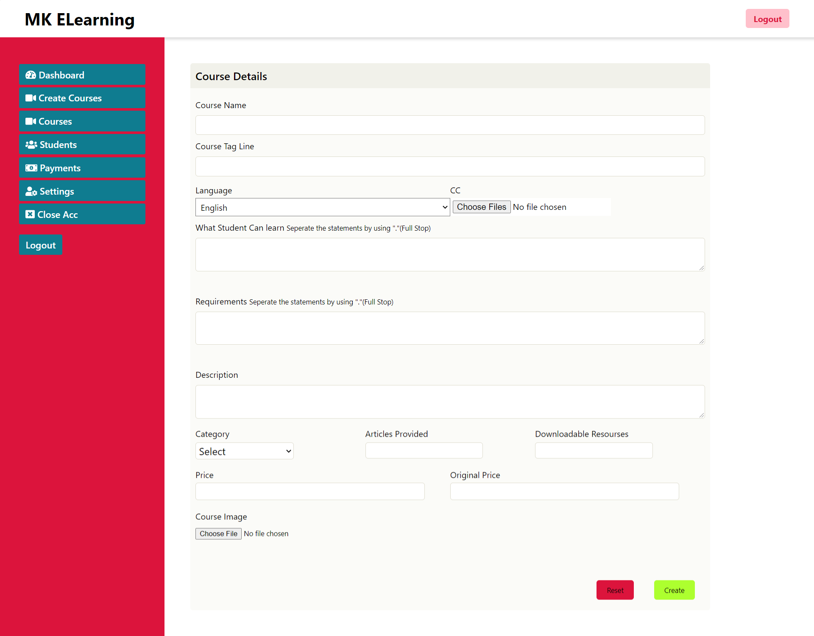
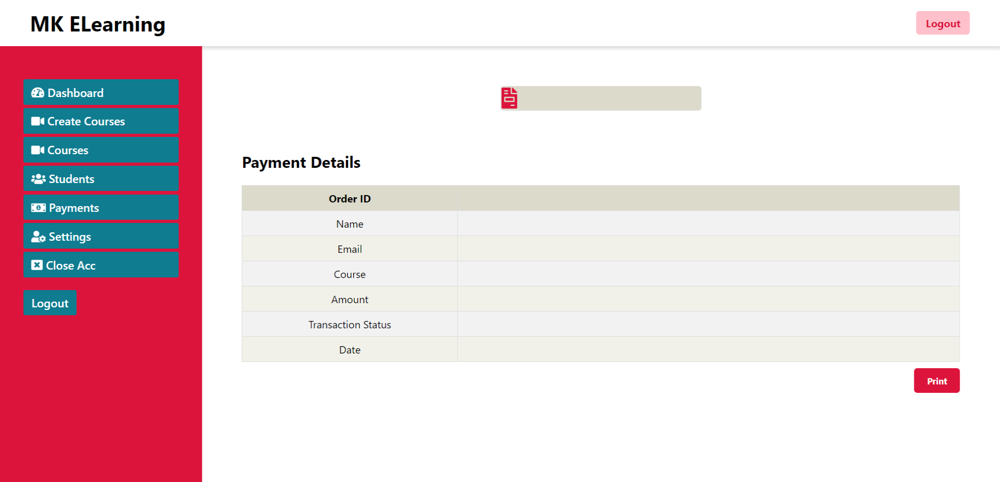
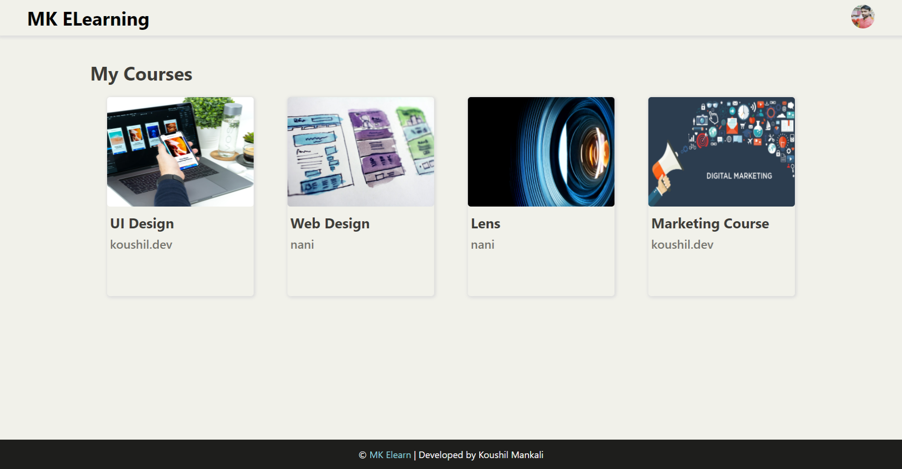
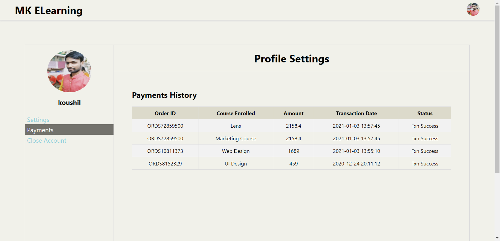
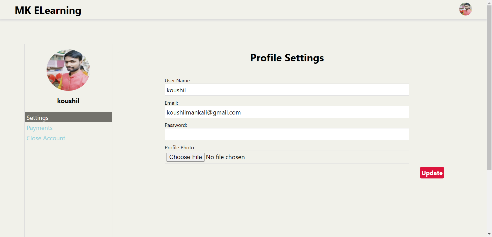

Project Uclone its a Udemy replica which have almost all features like udemy.

View the Video Demonstration of the Project here : 

 https://youtu.be/fE0tml6ryrI

About the Uclone (Project):

<h2>Main Features :</h2> 

-> Integrated with <strong>Paytm Payment Gateway</strong> for Purchasing courses.

-> Integrated <strong>SMTP</strong> for User and Instructor signup <strong>E-Mail Conformation(account creation)</strong> and also for <strong>OTP conformation</strong> for Password reset/change.

-> <strong>Comment</strong> and Course <strong>Rating System</strong>.

-> <strong>Remember Me</strong> functionality while login.(used tokens which will be stored in database and user browser cookies which will be checked for verification instead of passwords). for detailed info click here <a href='#remember_me'>Go to Remember Me Functionality Info</a>

-> User can search and select a course add to the cart or purchase it directly.

-> User gets there <strong>own dashboard </strong>to manage there course subscriptions and view video lectures also to manage there account information and settings.

-> Instructor(course uploader) will get there <strong>own dashboard</strong> to create new courses and manage there uploaded courses and can also get students basic information like who enrolled to there course and the payment details.

-> Instructor can add new lectures or remove lectures also can edit lectures from any course at any time.

-> In this project for better security and to avoid MySQL injection i have used PHP PDO.

-> Basic Coupon System.

and many more features like Udemy.

<h3>Navigate :</h3> 
<ul>
	<li><a href="#instructors_features">Instructors Features</a></li>
	<li><a href="#user_features">Users Features</a></li>
	<li><a href="#security_performance">SECURITY and PERFORMENCE</a></li>
	<li><a href="#how_to_use">How to use this Project</a></li>
</ul>

<h2>Home Page :</h2>

<h2>Instructors Features :</h2>

-> Instructor has there own dashboard where they get options like :   
	1) Dashboard       ---  Main Dashboard 
	2) Create Course   ---  Instructor can create course in this section. 
	3) Courses		   ---	All the Courses of instructor will be avaliable here, from here instructor can ... 
	&nbsp;	&nbsp;&nbsp;&nbsp;&nbsp;&nbsp;&nbsp;&nbsp;&nbsp;	&nbsp;	&nbsp;	a) Edit Course. 
	&nbsp;	&nbsp;&nbsp;&nbsp;&nbsp;&nbsp;&nbsp;&nbsp;&nbsp;	&nbsp;	&nbsp;	b) Add Lectures(Videos) and Sections of the Course. 
	&nbsp;	&nbsp;&nbsp;&nbsp;&nbsp;&nbsp;&nbsp;&nbsp;&nbsp;	&nbsp;	&nbsp;	c) Edit Lecture Details. 
	4) Students        ---  All the students basic details who are enrolled for this instructor courses. 
	5) Payments		   ---  Payment details of the students (like payment id, transaction success/failure, name of the student etc...). 
	6) Settings		   ---  All the account settings like name, email, password, description and profile pic (here instructor can change there details also). 
	7) Close Account   ---  If want instructor can close there account permantly by checking the mark and clicking the delete account button. 
	
Dashboard :

CreateCourse :

Payments :

<h2>Users Features :</h2>
	
-> User has there own dashboard where they get options like :   
	1) Dashboard       ---  Main Dashboard where all the enrolled courses will be there. 
	2) Payments		   ---  Payment details of the courses they have purchased. 
	3) Settings		   ---  All the account settings like name, email, password, description and profile pic (here user can change there details also). 
	4) Close Account   ---  If want user can close there account permantly by checking the mark and clicking the delete account button. 
	5) <strong>Videos Section</strong> --- when a user want to watch course lectures then can  
	&nbsp;	&nbsp;&nbsp;&nbsp;&nbsp;&nbsp;&nbsp;&nbsp;&nbsp;	&nbsp;	&nbsp;	a)Go to there dashboard where they can find there courses. 
	&nbsp;	&nbsp;&nbsp;&nbsp;&nbsp;&nbsp;&nbsp;&nbsp;&nbsp;	&nbsp;	&nbsp;	b)Click on the course then they will be redirected to videos section. 
	&nbsp;	&nbsp;&nbsp;&nbsp;&nbsp;&nbsp;&nbsp;&nbsp;&nbsp;	&nbsp;	&nbsp;	c) Here they can find there course video lectures section wise. 
	
==> User can search the courses and purchase the course they are willing to learn by just searching the course in search bar or exploring courses by category wise in the category pages.

Dashboard :

Payments :

Settings :

<h2>SECURITY and PERFORMENCE :</h2> 

-> Used tokens for Remember Me functionality instead of storing passwords in the user browser cookies for better security.(for detailed info click here <a href='#remember_me'>Go to Remember Me Functionality Info</a>)

-> Used hashed values to identify each course uniqly and to escape from user manupulations in the URL to access other courses (accessing other courses just by changing / manupulating course details in URL).

-> Passwords are hased before stronging in the database and for hasing i have used PHP's default but strong encryption algorithm and it will also verify passwords when a user login. 

-> For better security i have used PHP PDO for sql query.

-> For better code utilization i have created functions for each query and called it when ever required so code repitation is decreased a lot.

<h2>Remember Me Functionality Info :</h2>

==> Here for Remember Me functionality while login we have used tokens which will be stroed in the database and also in the user browser cookies, whenever a user login and checks the remember me box a token will be generated for the first time and stored in the database also in the browser cookie and next time when a user trys to login from the same browser and if there is a token avaliable in the browser cookie then it will be compaired with token in the database if it matches user will be logged in and a new token is generated and this new token will be replaced with old token in the database and browser cookie in case if the token didn't match then user will not be allowed to login unless they enter the password.
	

Stack Used : PHP and MySQL 

frontend : HTML5, CSS3, JavaScript.

backend : PHP.

database: MySQL.

<h2>How to use this Project :</h2>

->First you have need to do some changes in the file / add some details which are mentioned below. 

1)As this project has E-Mail conformation feature which uses SMTP you need a mail account so you have to add you'r mail id details in required file to run SMTP feature.

->Add you'r email account details in 

a)signup.php  // line no. 46,47  
b)instructor/signup.php  //line no. 46,47  

2) Now as we use Paytm payment gateway in this project we need to specify paytm merchant account details in the file "database/keys.php". 
It is (keys.php) is imported in paytm gateway file so you have to mention you'r merchant id and key here and it will be automatically be imported to paytm gatway file. 

3) To get some sample data in you'r course videos section replicate the video file in "videos folder" with following names (dont forget to provied exact .m4v extension as it is saved in database as .m4v).

video names:

5fdedb4c957bevideo.m4v
5fe497a3870b5video.m4v
5fe497b4eb1cavideo.m4v
5fe497e6721c4video.m4v
5fe497f8483ccvideo.m4v
5fe498e250eb6video.m4v
5fe4978c06613video.m4v
5fe4989e0e791video.m4v
5fe4993c72623video.m4v
5fe49883da0abvideo.m4v
5fe498251dd5cvideo.m4v
5fe499117788avideo.m4v

and there you go the project is ready to use.

Sample User Account Credentials : 

ID   : koushilmankali@gmail.com    
PASS : koushil1234

ID   : navya@gmail.com    
PASS : navya1234

Sample Instructor Account Credentials : 

ID   : koushil@gmail.com
PASS : koushil12

ID   : nani@gmail.com
PASS : nani12

Database Credentials :
Database Name : uclone
ID: root
PASS: // no password

-> Import database into phpmyadmin. (sql file is in "database" folder)

==> <a href='http://localhost/uclone/'>Open Project in Localhost</a>

